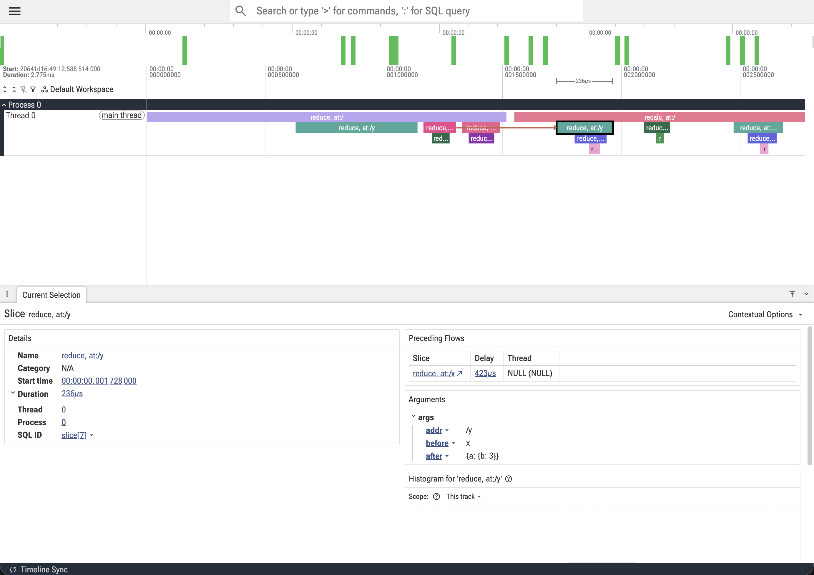
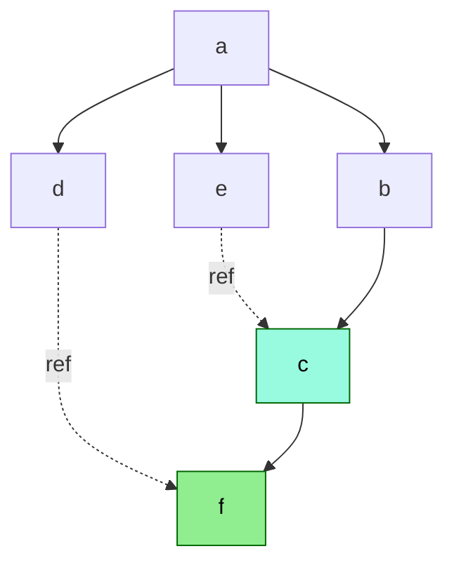

# Haskue 

A Haskell implementation of the [CUE](https://cuelang.org/) configuration language. Work in progress — parses,
evaluates, and exports a useful subset of CUE, but is not yet spec-compliant.

## Purpose of the Project

CUE is a configuration language built on top of ideas such as graph unification, constraint solving, and value lattice.
Writing configuration in CUE is more elegant and less error-prone than writing configuration in YAML or
JSON. However, in some cases, it is hard to understand why CUE evaluates a value to a certain result, or why it fails to
evaluate.

Haskell, on the other hand, is also a declarative language, and has a strong type system that shares a lot of
similarities with CUE's value lattice. In addition, they also share a lot of concepts, such as fixed-point evaluation
and lazy evaluation.

This project is an attempt to implement CUE in Haskell, to explore the similarities between the two
languages, and to make CUE's evaluation process easier to understand.

## Limitations

- Package/module system (basic import parsing exists, but loading and resolution are not)
- Standard libraries are not fully implemented.
- Built-in functions (only `close` and `slice` variants are implemented)
- Default values in ellipsis (`...<value>`)
- Definitions (`#foo`) and hidden fields (`_foo`) as first-class features
- Structural cycles are not allowed

## TODO

* package/module system
* built-in functions
* default values in ellipsis
* definitions and hidden fields fully implemented

## CLI Usage

Currently, haskue supports `eval` and `export` commands that behave similarly to the CUE CLI.

```
haskue eval   <file>
haskue export <file> [--out cue|json|yaml] [--trace]
```

We also provide a `--trace` option to print the evaluation trace of the value graph.

### Example of using the trace

Suppose we have a CUE file `example.cue` with the following content:

```cue
y: x
x: {a: z}
z: {b: 1 + 2}
```

Then running `haskue export example.cue --trace --trace-out=trace.json` will produce a `trace.json` file. We use the
`show-trace` command to visualize the trace:

```sh
$ haskue show-trace trace.json
Opening the trace (trace.log) in the browser
Open URL in browser: https://ui.perfetto.dev/#!/?url=http://127.0.0.1:9001/trace.log&referrer=open_trace_in_ui
```

Clicking the link will open a browser window with the trace visualized in Perfetto.



Then we can use `wsad` to navigate the trace, and click on a node to see its details. In the example above, we can see
that the after `x` getting evaluated, it triggers the re-evaluation of `y`, which is shown in the trace as a flow from
`x` to `y`.

## How evaluation is implemented

Evaluation of CUE values is interesting because there is no evaluation order as the CUE spec puts it.

> As a consequence, order of evaluation is irrelevant, a property that is key to many of the constructs in the CUE language as well as the tooling layered on top of it.

Here is a brief overview of how evaluation is implemented in haskue.

After scanning and parsing, the CUE source is represented as an AST. The AST is then converted into a graph of nodes.
Each node of the graph represents a value, which can be a primitive value, a struct, a list, an operation, or a
reference to another node. The presence of references turns the original tree structure of the AST into a directed graph.

The evaluation of the graph is divided into two phases: top-down evaluation and re-evaluation.

### Top-down evaluation

In the first phase, the top-down evaluation, the value graph is evaluated starting from the root node, which is the top-level CUE value. Each node is evaluated
by recursively evaluating its children, and then the node itself. If a node depends on other nodes, the dependency
graph is updated dynamically. The dependency graph is a component DAG (directed acyclic graph) where each vertex 
represents either a single node or a group of nodes that depend on each other formed by reference cycles. If a dependency node is not yet evaluated, the evaluation of the current node is suspended. The evaluation will move on
to the next node.

Once the top-down evaluation is complete, the node will be sent to the re-evaluation root queue.

### Re-evaluation

Re-evaluation resumes suspended nodes and re-evaluates nodes whose dependencies changed - for example, due to dynamic fields.

When the re-evaluation process starts, it pops a node which has been evaluated in the top-down evaluation from the
re-evaluation root queue and uses it to trigger the top-down evaluation of its dependents. Once a node is done after
top-down evaluation, the node and all of its ancestors will be used
to trigger the re-evaluation of their dependents. The re-evaluation will then propagate to the entire graph.

We minimize the number of re-evaluations by only re-evaluating nodes that see a change in their dependencies. For some
operations, such as unification, even if the operands change, the result may not change. For example, if `a` in the `a:
*1 | 2, b: a & 1` changes to just `1`, the result of `b` will still be `1`. We give each node a version, keep track of
the versions of its dependencies, and only re-evaluate the node if any of its dependencies has a newer version than the
last time it was evaluated. 

Consider the following value graph with node `f` recently re-evaluated:



`f` should not be the only node to trigger re-evaluation, but its ancestors `c`, `b`, `a` should also trigger it. So `c`,
`b`, `a` will have version incremented. In the diagram, we colored `f` and `c` to indicate that they will trigger
re-evaluation as they have dependents.